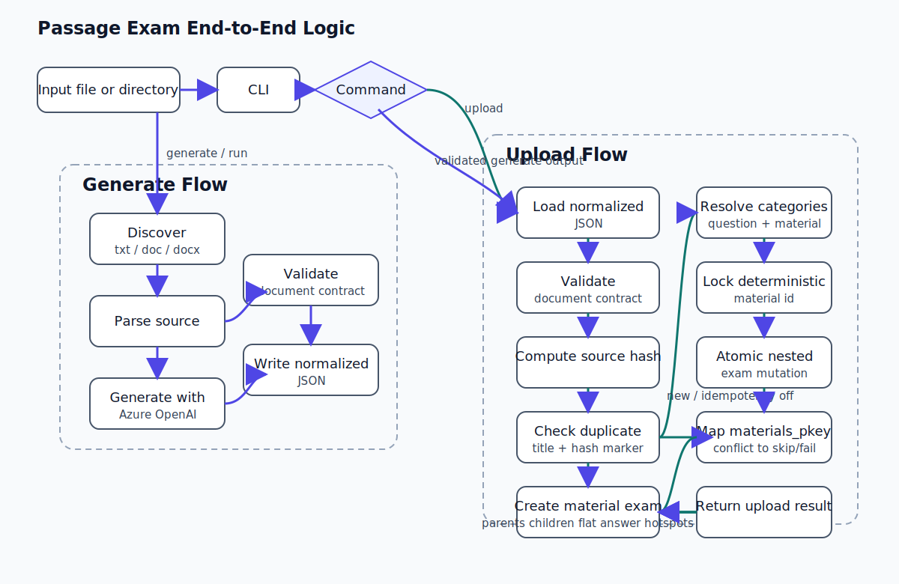
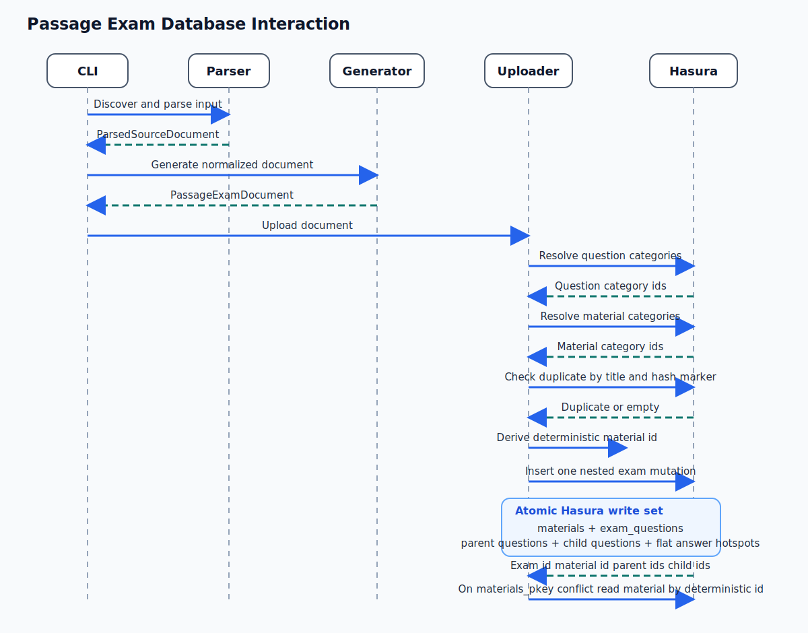
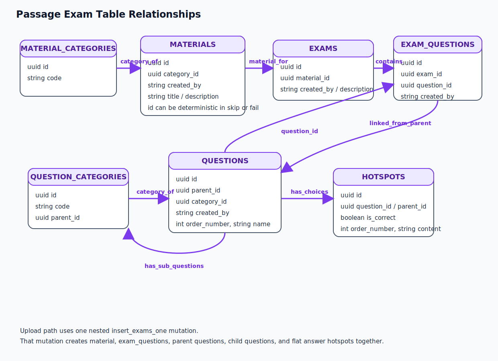

# Passage Exam

## Quick Start

1. Create and fill your local env file:

```bash
copy .env.example .env
```

Required values:

- `GRAPHQL_URL`
- `HASURA_ADMIN_SECRET`
- `AZURE_OPENAI_API_KEY`
- `AZURE_OPENAI_ENDPOINT`
- `AZURE_OPENAI_API_VERSION`
- `PASSAGE_EXAM_CREATED_BY`

Important:

- `PASSAGE_EXAM_CREATED_BY` must be a real user id that already exists in the target DB, otherwise publish will fail on the `materials.created_by` foreign key.

2. Apply the workflow schema in Hasura:

- run `docs/sql/passage_exam_workflow.sql` in the Hasura SQL console
- track `passage_exam.passage_exam_drafts`
- track `passage_exam.passage_exam_events`

3. Install backend dependencies in the Python environment you want to use:

```bash
pip install -r requirements.txt
```

4. Start the workflow API:

```bash
python -m src.main serve --host 127.0.0.1 --port 8001
```

5. Start the UI in a second terminal:

```bash
cd frontend
npm install
npm run dev
```

The checked-in Vite config serves the UI on `http://127.0.0.1:5174` and proxies API calls to `http://127.0.0.1:8001`.

On Windows PowerShell, use the bundled launcher instead of `bash start.sh`:

```powershell
.\start.ps1
```

## Troubleshooting

### 1. Publish fails with `fk_materials_created_by`

Symptom:

- publish returns `Internal Server Error` or a GraphQL foreign-key violation on `materials.created_by`

Cause:

- `PASSAGE_EXAM_CREATED_BY` or the publish actor id does not exist in the target DB user table

Fix:

- set `PASSAGE_EXAM_CREATED_BY` in `.env` to a real existing user UUID
- restart the backend after changing `.env`
- publish again

### 2. Publish returns `skipped: true`

Symptom:

- publish succeeds but `publish_result.skipped` is `true`
- `exam_id` is `null`
- `duplicate_material_id` is populated

Cause:

- the current normalized `PassageExamDocument` has the same canonical `source_hash` as an already-published document
- this is expected because publish uses idempotency mode `skip`

Fix:

- if you intended to avoid duplicates, no action is needed
- if you intended to create a new version, change the normalized content first, then publish again

### 3. Workflow API fails because Hasura draft tables are missing

Symptom:

- `/drafts` endpoints fail
- Hasura returns errors for `passage_exam_drafts` or `passage_exam_events`

Cause:

- the workflow schema SQL has not been applied, or the new tables were not tracked in Hasura metadata

Fix:

- run `docs/sql/passage_exam_workflow.sql` in the Hasura SQL console
- track:
  - `passage_exam.passage_exam_drafts`
  - `passage_exam.passage_exam_events`
- verify the tables are visible in the `default` Hasura source before starting the UI flow

## What The Current Flow Does

The current implementation supports:

- Parsing `txt`, `doc`, and `docx` sources
- Normalizing source text into one internal contract
- Generating passage-question bundles with Azure OpenAI
- Uploading the generated document into Hasura GraphQL
- Linking uploaded exams to parent passage questions only

The current implementation does **not** support:

- OCR or image-first ingestion
- `material_book_attachments`
- `question_groups`
- non-multiple-choice upload
- nested hotspot traversal through `hotspots.children` or `hotspots.parent_id`

## Package Structure

```text
src/
├── api/
│   ├── __init__.py
│   └── app.py
├── main.py
├── contracts.py
├── utils.py
├── generator/
│   ├── __init__.py
│   ├── prompt.py
│   └── service.py
├── parser/
│   ├── __init__.py
│   └── service.py
├── graphql/
│   ├── __init__.py
│   ├── client.py
│   ├── operations.py
│   └── workflow_operations.py
├── workflow/
│   ├── __init__.py
│   ├── contracts.py
│   └── service.py
└── uploader/
    ├── __init__.py
    └── service.py

frontend/
├── package.json
├── vite.config.ts
└── src/
    ├── App.tsx
    ├── api.ts
    └── types.ts
```

## Internal Contract

Everything is normalized into the following document shape before upload:

```json
{
  "title": "Reading Exam 01",
  "description": "Generated from a source file",
  "groups": [
    {
      "order": 1,
      "passage": "<p>Shared passage HTML</p>",
      "questions": [
        {
          "order": 1,
          "type": "multiple_choice",
          "question": "<p>Question HTML</p>",
          "choices": [
            { "content": "<p>A</p>", "is_correct": false },
            { "content": "<p>B</p>", "is_correct": true },
            { "content": "<p>C</p>", "is_correct": false },
            { "content": "<p>D</p>", "is_correct": false }
          ]
        }
      ]
    }
  ]
}
```

This contract is the package's source of truth. Parsing and generation both converge on this shape. Upload logic only consumes this normalized document.

## Runtime Entry Points

The CLI exposes four commands:

- `generate`: parse and generate normalized JSON only
- `upload`: upload an existing normalized JSON document
- `run`: generate and upload in one flow
- `serve`: run the workflow API used by the TypeScript UI

## Workflow Draft Layer

The package now includes a separate draft workflow for UI-driven review before publish:

- source upload and extraction
- draft persistence in Hasura under `passage_exam.passage_exam_drafts`
- audit trail in `passage_exam.passage_exam_events`
- generate -> review/edit -> validate -> publish flow
- publish still writes only to `materials`, `exams`, `questions`, `exam_questions`

Workflow API behavior:

- upload/generate/edit endpoints accept `X-User-Id` and store it in draft workflow metadata
- publish prefers `PASSAGE_EXAM_CREATED_BY` when configured, and falls back to `X-User-Id`
- publish uses uploader idempotency mode `skip`

The normalized draft payload remains the same `PassageExamDocument` contract used by the CLI and uploader.

## Hasura Migration

Before using the workflow API/UI, run:

`docs/sql/passage_exam_workflow.sql` in the Hasura SQL console for the `default` database source.

Then track the new tables in Hasura metadata:

- `passage_exam.passage_exam_drafts`
- `passage_exam.passage_exam_events`

The API assumes those tracked tables are exposed over Hasura GraphQL.

## Diagram Rendering

The source diagrams are stored under `docs/diagrams/*.mmd` and exported to `svg` for stable README rendering.

If you need to regenerate the SVG files, render the `.mmd` sources with Mermaid CLI.

## End-To-End Logic



How to read this diagram:

- any box that mentions `hotspots` in this repo means flat answer-option rows under a child multiple-choice question
- it does not mean the richer hotspot tree supported by the base schema through `hotspots.parent_id` and `hotspots.children`
- this package writes one level of answer options only, so the upload path never traverses nested hotspot trees

## Code Flow By Module

### 1. Parsing

`parser/service.py`:

- discovers supported source files recursively
- accepts only `.txt`, `.doc`, `.docx`
- extracts text from each file type
- normalizes whitespace and document title

Output:

- `ParsedSourceDocument(path, title, text)`

### 2. Generation

`generator/service.py`:

- loads environment variables with `load_dotenv()`
- calls Azure OpenAI using `AsyncAzureOpenAI`
- sends the parsed text plus prompt instructions
- expects a JSON object response
- validates the result against `PassageExamDocument`

### 3. Validation

`contracts.py` enforces:

- non-empty document title
- at least one passage group
- non-empty passage text
- at least one question per group
- multiple-choice only
- exactly one correct choice per question

### 4. Upload

`uploader/service.py`:

- hashes the normalized document
- appends `[source_hash:...]` to material and exam description
- checks for duplicates in `materials`
- locks idempotent uploads to a deterministic `materials.id`
- resolves category ids by category `code`, not by hardcoded UUID
- inserts one atomic `exams` mutation with nested `materials`
- inserts parent questions through nested `exam_questions.question.data`
- inserts child questions through nested `sub_questions`
- inserts choices through nested `questions_hotspots`
- inserts `exam_questions` linked to **parent** question ids only

## Current Database Write Flow

### Parent question insertion

Each passage group becomes one parent `questions` row:

- category path: `basic_question -> group`
- `questions.name` stores the passage HTML
- `questions.sub_questions.data` stores child question rows

### Child question insertion

Each generated multiple-choice question becomes a child `questions` row:

- category path: `basic_question -> multiple_choice -> single_choice`
- `parent_id` is created by the existing `sub_questions` relationship

### Answer option insertion

Each choice becomes a `hotspots` row through the `questions_hotspots` relationship:

- `hotspots.question_id` points to the child question
- `hotspots.content` stores answer HTML
- `hotspots.is_correct` marks the correct option
- `hotspots.order_number` preserves A/B/C/D ordering
- `hotspots.parent_id` is left unset in this flow, so these rows are flat answer options rather than nested hotspot nodes

The wider `hotspots` table is more general than what this package needs. In Hasura it also exposes fields and relations such as:

- `parent_id`
- `children`
- positional fields like `left`, `top`, and `path`
- extra fill or drop metadata

Those fields exist so the shared schema can support richer interactive question types such as click regions, nested hotspot groups, or drag/drop zones. `passage_exam` does not use that capability. Here, `hotspots` is only the storage shape already available for multiple-choice options.

### Exam insertion

The uploader inserts one `exams` row and nests:

- one `materials` row
- many `exam_questions` rows

`exam_questions` links the exam to **parent passage questions only**, not to child questions.

## Database Interaction Diagram



Read this diagram as one atomic write set that creates:

- the material row
- the exam row
- parent passage questions
- child multiple-choice questions
- flat answer-option hotspots only

## Table Relationship Diagram Used By This Flow



Important reading note:

- the base table `hotspots` can model more than answer options
- this package only uses the `questions -> hotspots` edge as a flat one-to-many choice list
- it does not populate or traverse hotspot-to-hotspot parent/child edges

## What Relationships The Current Code Uses Well

The current flow is reasonably aligned with the existing Hasura schema:

- It uses the category tree correctly through `question_categories.children`
- It uses the existing `sub_questions` relationship instead of manually setting child `parent_id`
- It uses the existing `questions_hotspots` relationship for answer options
- It uses nested `materials` creation under `exams`
- It uses `exam_questions` as a join table rather than inventing a custom link table
- It links exams to parent passage questions, which matches the grouped-passage model

This is good because it keeps the uploader close to the current database structure and avoids hardcoded category UUIDs.

## Where The Current Flow Is Still Limited

The current implementation is much tighter now, but there are still a few boundaries worth calling out.

### 1. Duplicate protection is race-safe, but still package-defined

Duplicate detection now uses:

- canonical document hash
- hash marker in `materials.description`
- a deterministic `materials.id` derived from the source hash when idempotency is `skip` or `fail`

This means concurrent idempotent uploads for the same normalized document will contend on `materials_pkey`, and the losing request can be mapped back to `skip` or `fail` without creating duplicate rows.

Consequence:

- the package now has DB-backed race protection without requiring a schema migration
- but the duplicate rule still lives in this package, not in a dedicated business-level unique constraint such as `title + source_hash`

### 2. Upload is atomic for the main write set

The uploader now sends one nested `insert_exams_one(object: ...)` mutation containing:

1. the `materials` row
2. all `exam_questions` rows
3. each parent passage question tree
4. each child question and its answer hotspots

Consequence:

- a failure in the mutation rolls back the whole upload
- the package no longer leaves behind partial question trees when exam creation fails

### 3. Hotspot relation support is only partially used

The database schema supports richer hotspot structures such as:

- `parent_id`
- `children`
- positional fields like `left` and `top`
- fill/drop metadata

The current `passage_exam` flow only uses `hotspots` as answer options for child questions.

What that means in practice:

- each child question gets a flat list of 4 hotspot rows
- those rows are just the A/B/C/D options with `content`, `is_correct`, and `order_number`
- no hotspot row becomes the parent of another hotspot row
- no geometry, click-region coordinates, SVG paths, or nested traversal is involved

Why the schema still has those extra fields:

- Hasura is sitting on a broader platform schema that can represent richer interactive exercises
- the same `hotspots` table can serve image regions, fill targets, grouped interaction zones, or nested hotspot trees
- reusing that table lets this package fit the existing database without inventing a new answer-option table

Why this package deliberately does not use them:

- passage review and publish only need a simple multiple-choice list
- a flat shape keeps the UI, validation, and upload payload much simpler
- nested hotspot trees would add complexity without solving a real requirement for passage exams

Consequence:

- good fit for multiple-choice
- no use of advanced hotspot hierarchy or geometry

### 4. `created_by` must reference a real user

The uploader accepts a `created_by` string, but the DB enforces a foreign key behind `materials.created_by`.

Consequence:

- a random UUID is valid in shape
- but upload will fail unless that UUID already exists in the user domain

The CLI defaults this value from `PASSAGE_EXAM_CREATED_BY`, falling back to `system`.

## Operational Summary

If you want to reason about the current persistence model in one sentence:

> One passage group becomes one parent question, its multiple-choice items become child questions, each child question stores four flat answer-option rows in `hotspots`, and the final exam links only to the parent question ids while also creating a nested material row.

## Environment Variables

Current environment variables used by this package:

```env
PASSAGE_EXAM_CREATED_BY=
AZURE_OPENAI_API_KEY=
AZURE_OPENAI_ENDPOINT=
AZURE_OPENAI_API_VERSION=
AZURE_OPENAI_DEPLOYMENT_NAME=
GRAPHQL_URL=
HASURA_ADMIN_SECRET=
```

## Example Commands

Generate only:

```bash
python -m src.main generate --input path/to/file.docx --output-dir output
```

Upload only:

```bash
python -m src.main upload --input-json output/exam.json
```

Generate and upload:

```bash
python -m src.main run --input path/to/file.docx --output-dir output
```

Run the workflow API:

```bash
python -m src.main serve --host 127.0.0.1 --port 8001
```

Run the TypeScript UI:

```bash
cd frontend
npm install
npm run dev
```

The checked-in Vite config currently serves the UI on `127.0.0.1:5174` and proxies API calls to `127.0.0.1:8001`.

The current flow is already good enough to extract into a separate repository if the scope remains:

- text-first
- passage-group based
- multiple-choice only
- Hasura-backed

Before publishing it as a standalone repo, the highest-value follow-up improvements would be:

1. add a standalone `.env.example` for this package only
2. add one integration test for nested Hasura upload payloads
3. consider a backend RPC or DB-level business unique key for duplicate semantics
4. document the `created_by` foreign-key requirement explicitly
5. document that `hotspots` in this flow means answer options, not geometry-only hotspots
